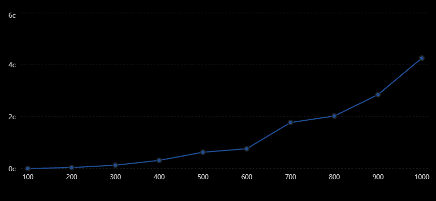

# Лабораторная работа №1 — последовательное умножение матриц

## Цель работы

Разработать программу на языке C++ для последовательного перемножения двух квадратных матриц.

Программа должна:

* считывать исходные матрицы из файлов;
* выполнять их умножение;
* сохранять полученную матрицу в файл;
* измерять время выполнения вычислений;
* автоматически проверять корректность результата с помощью стороннего программного обеспечения.

## Описание

В лабораторной работе реализовано последовательное умножение квадратных матриц.

Основные вычисления выполняются с помощью трёх вложенных циклов. Для каждого элемента результирующей матрицы вычисляется скалярное произведение соответствующей строки первой матрицы и столбца второй.

Исходные данные и результат работы программы хранятся в текстовых файлах.

Для автоматической проверки результата используется Python и библиотека NumPy. Результат, полученный программой на C++, сравнивается с результатом независимого вычисления через операцию матричного умножения NumPy.
## Структура лабораторной работы

```text
lab1/
├── input/
│   ├── matrixA.txt          # первая исходная матрица
│   └── matrixB.txt          # вторая исходная матрица
│
├── output/
│   └── result.txt           # результирующая матрица
│
├── c++/
│   └── main.cpp             # исходный код программы
│
├── generate.py              # генерация тестовых матриц
├── verify.py                # автоматическая проверка результата
└── CMakeLists.txt            # конфигурация сборки проекта
```

## Сборка и запуск

Для сборки проекта используется CMake и Ninja.

Из корневой директории репозитория:

```text
cmake -S . -B build -G Ninja -DCMAKE_BUILD_TYPE=Release
cmake --build build
```

После сборки исполняемый файл находится в:

```text
build/lab1/lab1.exe
```

Программа запускается из директории `build/lab1`:

```text
cd build/lab1
./lab1.exe
```

Программа считывает матрицы `matrixA.txt` и `matrixB.txt`, выполняет их умножение и сохраняет результат в:

```text
lab1/output/result.txt
```

В консоль выводится размер матриц и время выполнения операции умножения.

## Генерация данных

Тестовые матрицы генерируются скриптом `generate.py`. Размер матриц передаётся аргументом:

```text
python generate.py 1000
```

Скрипт создаёт `matrixA.txt` и `matrixB.txt` в директории `input/`.

## Верификация

Корректность результата автоматически проверяется с помощью Python и библиотеки NumPy. Скрипт `verify.py` независимо перемножает исходные матрицы и сравнивает результат с матрицей, полученной программой на C++.

```text
python verify.py
```

При успешной проверке выводится:

```text
Результат корректен
```

## Условия проведения эксперимента

* Процессор: AMD Ryzen 7 5825U with Radeon Graphics
* Оперативная память: 16 ГБ
* ОС: Windows
* Компилятор: MSVC
* Стандарт C++: C++23
* Конфигурация сборки: Release

  ## Результаты измерений

Измерение времени выполнялось для матриц размером от `100 × 100` до `1000 × 1000` с шагом `100`.

Замер проводился только для операции умножения матриц, без учёта чтения и записи файлов. Программа собиралась в конфигурации `Release`.

| Размер матрицы | Время, мкс | Время, с |
| -------------: | ---------: | -------: |
|      100 × 100 |      4 737 |   0.0047 |
|      200 × 200 |     41 007 |   0.0410 |
|      300 × 300 |    132 709 |   0.1327 |
|      400 × 400 |    317 919 |   0.3179 |
|      500 × 500 |    632 157 |   0.6322 |
|      600 × 600 |    765 242 |   0.7652 |
|      700 × 700 |  1 776 368 |   1.7764 |
|      800 × 800 |  2 027 680 |   2.0277 |
|      900 × 900 |  2 850 711 |   2.8507 |
|    1000 × 1000 |  4 258 211 |   4.2582 |

В целом с увеличением размера матриц время выполнения возрастает. Используемый алгоритм последовательного умножения матриц имеет вычислительную сложность `O(n³)`.

График



Вывод

В ходе работы была реализована последовательная программа для умножения квадратных матриц на C++. Программа выполняет чтение исходных данных из файлов, вычисляет результирующую матрицу и сохраняет её в файл.

Корректность вычислений подтверждена автоматической проверкой с использованием Python и библиотеки NumPy.

Проведённые измерения показали увеличение времени выполнения при увеличении размера матриц. Это соответствует вычислительной сложности используемого алгоритма последовательного умножения матриц O(n³).

