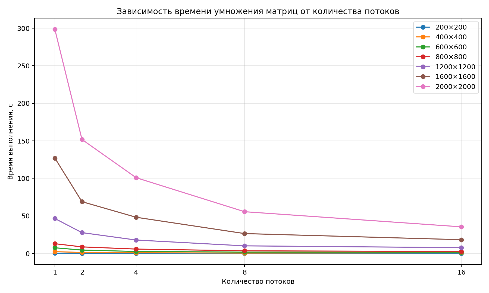
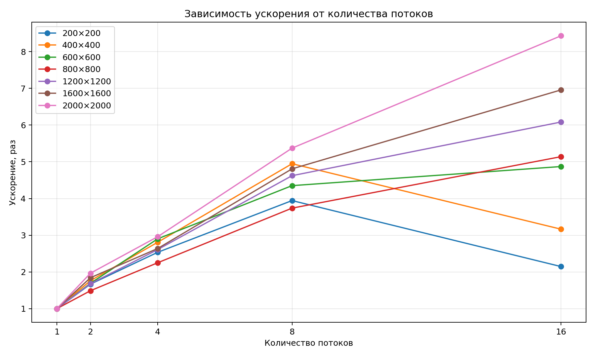

# Лабораторная работа №2 — OpenMP

## Цель работы

Модифицировать программу из лабораторной работы №1 для параллельного умножения квадратных матриц с использованием технологии OpenMP и исследовать зависимость времени выполнения от количества потоков и размера задачи.

## Реализация

В лабораторной работе №1 использовалось обычное последовательное умножение матриц.

В лабораторной работе №2 параллелизирован внешний цикл умножения матриц:

```cpp
#pragma omp parallel for
for (int i = 0; i < _rows; i++)
{
    for (int j = 0; j < other._cols; j++)
    {
        for (int k = 0; k < _cols; k++)
        {
            res(i, j) += (*this)(i, k) * other(k, j);
        }
    }
}
```
Каждый поток обрабатывает отдельные строки результирующей матрицы, поэтому несколько потоков не записывают одновременно в одну и ту же строку результата.

Количество потоков задаётся при запуске программы:
```cpp
omp_set_num_threads(threads);
```
где `threads` передаётся первым аргументом командной строки.

## Сборка

Используется CMake и OpenMP.
```powershell
cmake -S lab2 -B build/lab2 -G Ninja -DCMAKE_BUILD_TYPE=Release
cmake --build build/lab2
```
## Запуск

После сборки:
```powershell
cd build/lab2
./lab2.exe 8
```
Последний аргумент задаёт количество потоков OpenMP.

Например:

```powershell
./lab2.exe 1
./lab2.exe 2
./lab2.exe 4
./lab2.exe 8
./lab2.exe 16
```
## Проверка результата

Для автоматической проверки используется Python и NumPy.
```powershell
cd lab2
python verify.py
```
Проверка сравнивает результат программы на C++ с результатом умножения тех же матриц средствами NumPy.

Результат проверки:
```text
Результат корректен
```

## Условия эксперимента

Эксперименты проводились для размеров матриц:

- 200×200
- 400×400
- 600×600
- 800×800
- 1200×1200
- 1600×1600
- 2000×2000

Для каждого размера использовалось:

- 1 поток
- 2 потока
- 4 потока
- 8 потоков
- 16 потоков

Все измерения выполнялись в конфигурации `Release`.

### Аппаратное обеспечение

- CPU: AMD Ryzen 7 5825U with Radeon Graphics
- 8 физических ядер
- 16 логических потоков
- RAM: 16 GB
- ОС: Windows

### Программное обеспечение

- C++23;
- MSVC;
- CMake;
- Ninja;
- OpenMP;
- Python;
- NumPy 2.5.3.

## Результаты
В таблице приведено время умножения матриц в секундах.

| Размер | 1 поток | 2 потока | 4 потока | 8 потоков | 16 потоков |
|---|---:|---:|---:|---:|---:|
| 200×200 | 0.273 | 0.163 | 0.108 | 0.069 | 0.127 |
| 400×400 | 2.294 | 1.301 | 0.817 | 0.464 | 0.724 |
| 600×600 | 7.495 | 4.431 | 2.583 | 1.723 | 1.539 |
| 800×800 | 12.930 | 8.684 | 5.747 | 3.459 | 2.516 |
| 1200×1200 | 46.469 | 27.663 | 17.809 | 10.054 | 7.640 |
| 1600×1600 | 126.983 | 68.908 | 48.133 | 26.411 | 18.254 |
| 2000×2000 | 298.419 | 151.790 | 100.843 | 55.549 | 35.402 |

## Графики

### Время выполнения



### Ускорение



## Анализ результатов

При увеличении количества потоков время выполнения в большинстве случаев уменьшается. Однако увеличение количества потоков не гарантирует пропорционального ускорения.

Для небольших матриц накладные расходы на создание и координацию потоков становятся заметными. Например, для матрицы 200×200 наилучший результат получен при 8 потоках — 0.069 с, тогда как при 16 потоках время увеличилось до 0.127 с.

Для матрицы 400×400 также лучший результат получен при 8 потоках — 0.464 с. При переходе к 16 потокам время увеличилось до 0.724 с.

Начиная с размера 600×600, 16 потоков в проведённом эксперименте дают лучший или близкий к лучшему результат. Для больших матриц преимущество параллельного выполнения становится более выраженным.

Для матрицы 2000×2000 время уменьшилось с 298.419 с при одном потоке до 35.402 с при 16 потоках. Ускорение составило примерно 8.43 раза.

Для матриц 1200×1200 и 1600×1600 ускорение при переходе от одного к 16 потокам составило примерно 6.08 и 6.96 раза соответственно.

Таким образом, эффективность параллелизации зависит от размера задачи. Чем больше матрица, тем значительнее доля вычислений относительно накладных расходов на организацию параллельного выполнения.

Во время эксперимента с матрицей 1600×1600 также наблюдалась высокая загрузка процессора. При 8 потоках загрузка составляла примерно 52%, а при 16 потоках достигала 98–100%. При этом увеличение загрузки процессора не означает пропорционального увеличения производительности: на результат влияют накладные расходы OpenMP, особенности работы с памятью и другие ограничения аппаратной системы.

## Вывод

В ходе лабораторной работы программа последовательного умножения матриц была модифицирована для параллельного выполнения с использованием OpenMP.

Эксперимент показал, что увеличение количества потоков позволяет значительно сократить время вычислений на больших матрицах. При этом для небольших задач использование слишком большого количества потоков может, наоборот, увеличить время выполнения из-за накладных расходов параллелизации.

Максимальное полученное ускорение в проведённой серии экспериментов составило примерно 8.43 раза для матрицы 2000×2000 при использовании 16 потоков.

